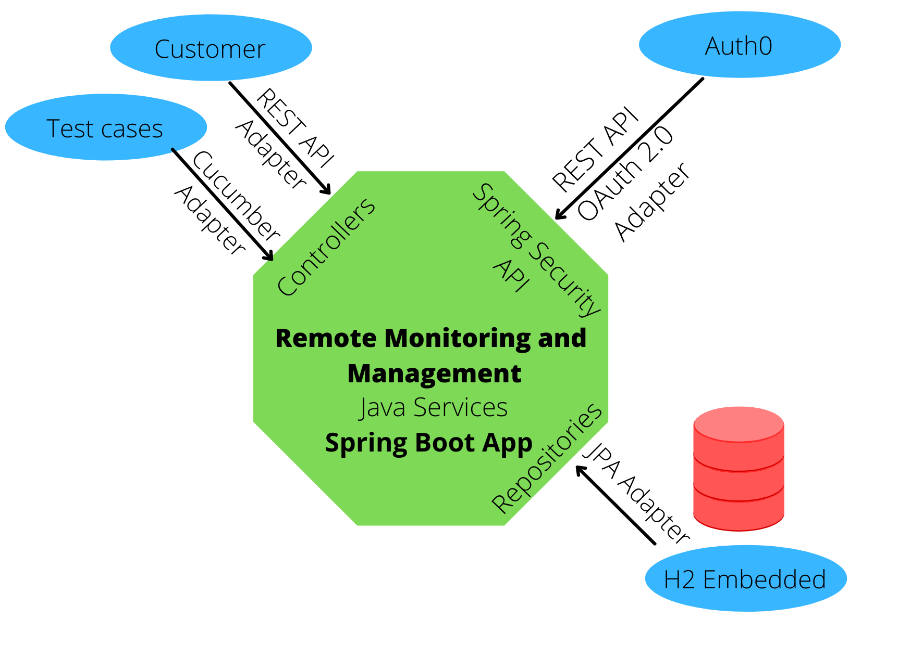

# Ninjaone Remote Monitoring and Management App
Remote Monitoring and Management (RMM) company provides services that monitor
and manage devices.
## Software requirements
- Java JDK 11
- Docker
## Architecture
This project use Clean Code Architecture with DDD patterns and BDD patterns. The architecture permits switch the adapters easily to external database or REST services as improvement. 



## Technology
The application use the next tools and frameworks:
- Java 11
- Gradle 7
- Spring Boot 2
- Auth0
- OAuth 2.0
- JPA 2.2
- Postgresql
- QueryDSL 5
- Lombok
- Cucumber 7
- Junit 5
## Structure folders
### Main source folder
- "com.ninjaone.rmm" as package base
- "application" subpackage for logic application
- "domain" subpackage to deliver information to client
- "infrastructure" subpackage to implements specific integrations to external tools
- "resources" package to locate config files to application
### Test source folder
- "com.ninjaone.rmm" as package base
- "test" subpackage to implements Unit Test and Integration Test of application
- "resources" package to locate Gherkin features files to implement BDD testing
- Unit test scenarios coded in file "test/resources/features/unit_test_rmm.feature" relative to project folder
- Functional/Integration test scenarios coded in file "test/resources/features/functional_test_rmm.feature" relative to project folder
## Installation instructions
1. Unzip the code
2. Execute the next code in command line console to compile and run test:
```
gradlew clean build
```
3. Execute the next code to run test
```
gradlew test
```
4. Execute the next code for run standalone application in console. 
```
gradlew bootRun 
```
5. Execute the next code to generate Docker image
```
gradlew bootBuildImage
```
6. Run PostgreSQL database as docker container. Execute in command line, in project directory.
```
docker run --name ninjaone-rmm-db -p 5432:5432 -e POSTGRES_PASSWORD=s3cr37n1nj40n3 -d postgres
docker cp src/main/resources/database-setup/backup-database.sql ninjaone-rmm-db:/var/backups
docker exec -i ninjaone-rmm-db bash -c "cat /var/backups/backup-database.sql | psql -U postgres -d postgres" 
```
7. Run application in container mode. 
```
docker run --rm --name ninjaone-rmm -p 8080:8080 rmm-services-server-app:0.0.1-SNAPSHOT
```
8. To view the test report, open the next file relative to this project folder
```
build/reports/tests/test/index.html
```
9. To view the coverage code report, open the next file relative to this project folder
```
build/reports/jacoco/test/html/index.html
```
10. To view the behavior test report, open the next file relative to this project folder
```
build/cucumber/report.html
```
10. To view the static code analysis, open the next link https://sonarcloud.io/project/overview?id=barahonachrism_rmm-services-server-app
11. If need run the test the api using Postman App, import the next collection api:
```
src/test/resources/postman/Ninjaone API collection.postman_collection.json
```
12. If you need a database backup, execute the next code, from command line relative to project folder
```
docker exec -i ninjaone-rmm pg_dump -c -U postgres postgres > src/main/resources/database-setup/backup-database.sql 
```