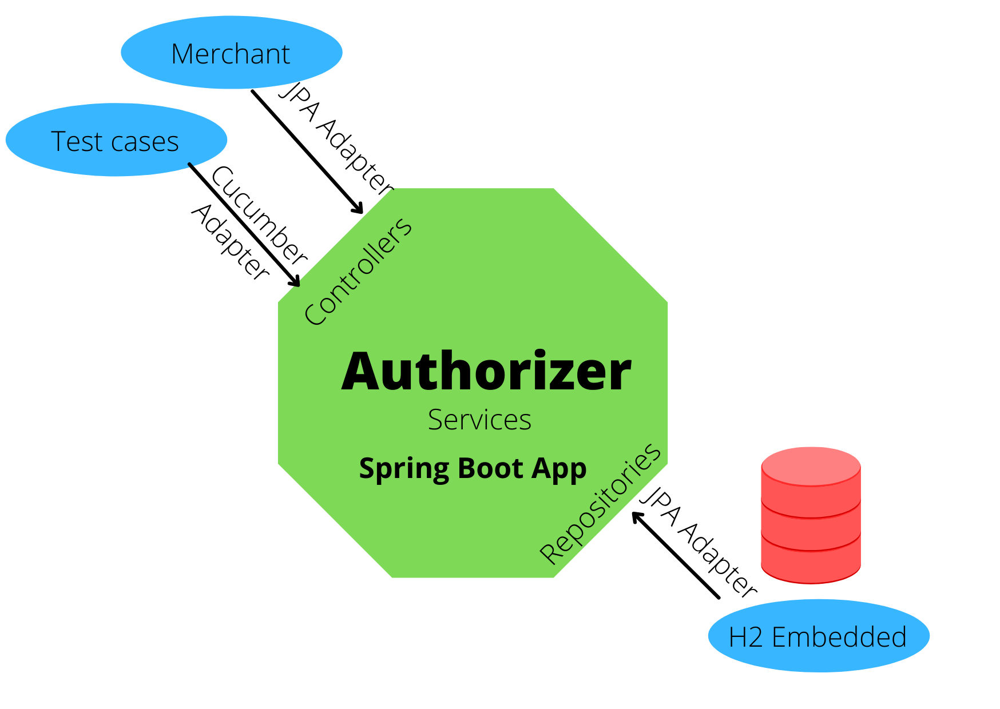

# Nubank Authorizer Transaction App
Application to create a credit card account and register payment transactions in authorized stores

## Software requirements
- Java JDK 11
- Docker
## Architecture
This project use Clean Code Architecture with DDD patterns and BDD patterns. The architecture permits switch the adapters easily to external database or REST services as improvement. 



## Technology
The application use the next tools and frameworks:
- Java 11
- Gradle 7
- Spring Boot 2
- JPA 2.2
- H2 Database embedded
- Lombok
- Mapstruct
- Cucumber 7
- Junit 5
## Structure folders
### Main source folder
- "com.nubank.authorizer" as package base
- "application" subpackage for logic application
- "domain" subpackage to deliver information to client
- "infrastructure" subpackage to implements specific integrations to external tools
- "resources" package to locate config files to application
### Test source folder
- "com.nubank.authorizer" as package base
- "test" subpackage to implements Unit Test and Integration Test of application
- "resources" package to locate Gerkhins features files to implement BDD testing
- Unit test scenarios coded in file "test/resources/features/unit_test_transactions_account.feature" relative to project folder
- Functional/Integration test scenarios coded in file "test/resources/features/functional_test_transactions.feature" relative to project folder
## Installation instructions
1. Unzip the code
2. Execute the next code in command line console to compile and run test:
```
gradlew clean build
```
3. Execute the next code to run test
```
gradlew test
```
4. Execute the next code for run standalone application in console. Replace "src\test\resources\inputs\transaction_high_frequency_small_interval.request" for another input file operations.
```
gradlew bootRun --args='--spring.profiles.active=pro' < src\test\resources\inputs\transaction_high_frequency_small_interval.request 
```
5. Execute the next code to generate Docker image
```
gradlew bootBuildImage
```
6. Run application in container mode.  Replace "src\test\resources\inputs\transaction_high_frequency_small_interval.request" for another input file operations.
```
docker run --rm --name nubank-authorizer -e "SPRING_PROFILES_ACTIVE=pro" -i nubank-authorizer:0.0.1-SNAPSHOT < src\test\resources\inputs\transaction_high_frequency_small_interval.request
```
7. To view the test report, open the next file relative to this project folder
```
build/reports/tests/test/index.html
```
8. To view the coverage code report, open the nex file relative to this project folder
```
build/reports/jacoco/test/html/index.html
```
